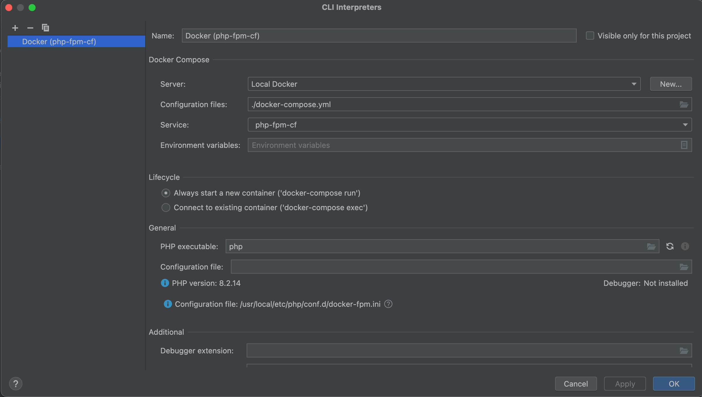

# Services for locale Development

<table>
    <thead>
        <tr>
            <td>Service</td>
             <td>Container Name</td>
             <td>Ports</td>
             <td>Network</td>
             <td>Credentials</td>
        </tr>
    </thead>
    <tbody>
        <tr>
            <td>MariaDB 10.9.3</td>
            <td>mariadb-10-9</td>
            <td>13306:3306</td>
            <td>dev_network</td>
            <td>
                MYSQL_ROOT_PASSWORD: root-password<br>
                MARIADB_DATABASE: dev-database<br>
                MARIADB_USER: dev-user<br>
                MARIADB_PASSWORD: dev-password<br>
            </td>
        </tr>
        <tr>
            <td>MariaDB 10.6.16</td>
            <td>mariadb-10-6</td>
            <td>13307:3306</td>
            <td>dev_network</td>
            <td>
                MYSQL_ROOT_PASSWORD: root-password<br>
                MARIADB_DATABASE: dev-database<br>
                MARIADB_USER: dev-user<br>
                MARIADB_PASSWORD: dev-password<br>
            </td>
        </tr>
        <tr>
            <td>Redis 7.2.4</td>
            <td>redis-7-2</td>
            <td>16379:6379</td>
            <td>dev_network</td>
            <td></td>
        </tr>
        <tr>
            <td>MongoDB 7.0.12</td>
            <td>mongo-7-0</td>
            <td>27017:27017</td>
            <td>dev_network</td>
            <td>
                MONGO_INITDB_ROOT_USERNAME: root<br>
                MONGO_INITDB_ROOT_PASSWORD: root-dev-password<br>
            </td>
        </tr>
        <tr>
            <td>PHP-FPM 8.2.21 for CodeSniffer</td>
            <td></td>
            <td></td>
            <td>dev_network</td>
            <td></td>
        </tr>
        <tr>
            <td>S3Mock 3.5.2</td>
            <td>s3mock-5-3</td>
            <td>
                9090:9090<br>
                9091:9091 (Admin)</span>
            </td>
            <td>dev_network</td>
            <td></td>
        </tr>
        <tr>
            <td>S3Mock 3.6.0</td>
            <td>s3mock-6-0</td>
            <td>
                9092:9090<br>
                9093:9091 (Admin)</span>
            </td>
            <td>dev_network</td>
            <td></td>
        </tr>
        <tr>
            <td>min.io RELEASE.2024-06-29T01-20-47Z</td>
            <td>minio</td>
            <td>
                9004:9000<br>
                9005:9001 (Admin)</span>
            </td>
            <td>dev_network</td>
            <td>
                MINIO_ROOT_USER: minio<br>
                MINIO_ROOT_PASSWORD: dev-password<br>
            </td>
        </tr>
    </tbody>
</table>

## Installation

### Clone project

```bash
git clone git@github.com:alaugks/docker-local-env.git
```

### Change directory

```bash
cd docker-local-env
```

### Run docker compose

```bash
docker compose up -d
```

## Example of usage (MariaDB 10.9.*)

### Example Symfony

**.env.local**

```dotenv
DB_DRIVER=mysql
DB_USER=dev-user
DB_PASSWORD=dev-password
DB_HOST=mariadb-10-9
DB_PORT=3306
DB_NAME=your_database
DB_SERVER_VERSION=10.9.3-MariaDB
```

**services.yaml**

```yaml
parameters:
  database_url: '%env(DB_DRIVER)%://%env(DB_USER)%:%env(DB_PASSWORD)%@%env(DB_HOST)%:%env(DB_PORT)%/%env(DB_NAME)%?serverVersion=%env(DB_SERVER_VERSION)%'
```

### Example Spring Boot

**application.properties**

```dotenv
spring.datasource.url=jdbc:mariadb://mariadb-10-9:3306/your_database
spring.datasource.username=dev-user
spring.datasource.password=dev-password
spring.datasource.driver-class-name=org.mariadb.jdbc.Driver
```

## Use CodeSniffer in PHPStorm

**Settings CLI Interpreters**




**Settings PHP CodeSniffer**


**Path Code Sniffer**

```
/var/www/html/vendor/squizlabs/php_codesniffer/bin/phpcs
```


**Path Code Beautifier**

```
/var/www/html/vendor/squizlabs/php_codesniffer/bin/phpcbf
```
